The Rankings of Texas Counties Based on Multiple Factors
================

\#Adam Shaheen as94432 To begin the project I had to find two datasets
that revealed data to me that I found interesting. I always wanted to
see how counties ranked amoungst one another and which races reaped the
benefits of these rankings. This perplextion was fueled by the whether
or not counties had different populations and different socioeconomic
status. Furthermore, the ranking data set is a ranking based on clinical
care, length of life, quality of life, and socioeconomic factors. While
the County health ranking includes variables such as Texas death rates
per county, population divided up into different ethnicities, healthcare
costs, and household income. Both these datasets were derived from The
County Health Rankings & Roadmaps website, 2016 spreadsheets. I expect
to find counties with a low household income to have high death rates
due to their economic status and inability and low rankings across the
boards. I also expect, due to the deep systemic racism within our
country, that nearly race that does not associate with being white will
reside within these low ranking counties.

``` r
#install libraries
library(dplyr)
```

    ## 
    ## Attaching package: 'dplyr'

    ## The following objects are masked from 'package:stats':
    ## 
    ##     filter, lag

    ## The following objects are masked from 'package:base':
    ## 
    ##     intersect, setdiff, setequal, union

``` r
library(tidyverse)
```

    ## -- Attaching packages --------------------------------------- tidyverse 1.3.0 --

    ## v ggplot2 3.3.3     v purrr   0.3.4
    ## v tibble  3.0.5     v stringr 1.4.0
    ## v tidyr   1.1.2     v forcats 0.5.0
    ## v readr   1.4.0

    ## -- Conflicts ------------------------------------------ tidyverse_conflicts() --
    ## x dplyr::filter() masks stats::filter()
    ## x dplyr::lag()    masks stats::lag()

``` r
library(readxl)

library(ggplot2)
```

\#\#Part 1: Creating Datasets out of Excel improted documents and
joinging them into Joined\_stats

``` r
Ranking <- read_excel("death rate per county.xlsx")

County_Health_Rankings <- read_excel("2016 County Health.xlsx")

#the two lines above read excel files within the same work directory

Joined_stats <- Ranking %>%
  
left_join(County_Health_Rankings, by="County")%>%
  
#above is the creation of a unification of the newly defined data #frames by county. I choose
#the left join because I wanted to add additional data to the #rankings dataset
 
mutate(Total_AADeaths =`Total Deaths` * `Per.African.American`)%>%
  
mutate(Total_AsianDeaths =`Total Deaths` * `Per.Asian`)%>%
  
mutate(Total_HispanicDeath =`Total Deaths` * `Per.Hispanic`)%>%
  
mutate(Total_WhiteDeath =`Total Deaths` * `Per.NonHispanic.White`)%>%
  
mutate(Total_Native_or_ortherDeath =`Total Deaths` * `Per.Native.Hawaiian/Other.Pacific.Islander`)

#mutating new rows to determine the total deaths for each population of races for 2016
head(Ranking)
```

    ## # A tibble: 6 x 3
    ##   County    `Total Deaths` Trend  
    ##   <chr>              <dbl> <chr>  
    ## 1 Anderson            1048 rising 
    ## 2 Andrews              180 falling
    ## 3 Angelina            1213 stable 
    ## 4 Aransas              497 stable 
    ## 5 Archer               109 stable 
    ## 6 Armstrong             27 <NA>

``` r
head(County_Health_Rankings)
```

    ## # A tibble: 6 x 20
    ##   County Child.Deaths Infant.Deaths Drug.Overdose.D~ Motor.Vehicle.D~
    ##   <chr>         <dbl>         <dbl>            <dbl>            <dbl>
    ## 1 Ander~           29            25               19              108
    ## 2 Andre~           10            NA               NA               43
    ## 3 Angel~           43            44               21              133
    ## 4 Arans~           14            NA               12               32
    ## 5 Archer           NA            NA               NA               13
    ## 6 Armst~           NA            NA               NA               NA
    ## # ... with 15 more variables: Household.Income <dbl>,
    ## #   Segregation.index.of.African.Americans <dbl>,
    ## #   `Segregation.Index.of.non-White.races` <dbl>, Population <dbl>,
    ## #   Per.over.18 <dbl>, Per.65.and.over <dbl>, Per.African.American <dbl>,
    ## #   `Per.American.Indian/Alaskan.Native` <dbl>, Per.Asian <dbl>,
    ## #   `Per.Native.Hawaiian/Other.Pacific.Islander` <dbl>, Per.Hispanic <dbl>,
    ## #   Per.NonHispanic.White <dbl>, Per.Female <dbl>, Per.Rural <dbl>, `Social &
    ## #   Economic Factors Rank` <dbl>

``` r
head(Joined_stats)
```

    ## # A tibble: 6 x 27
    ##   County `Total Deaths` Trend Child.Deaths Infant.Deaths Drug.Overdose.D~
    ##   <chr>           <dbl> <chr>        <dbl>         <dbl>            <dbl>
    ## 1 Ander~           1048 risi~           29            25               19
    ## 2 Andre~            180 fall~           10            NA               NA
    ## 3 Angel~           1213 stab~           43            44               21
    ## 4 Arans~            497 stab~           14            NA               12
    ## 5 Archer            109 stab~           NA            NA               NA
    ## 6 Armst~             27 <NA>            NA            NA               NA
    ## # ... with 21 more variables: Motor.Vehicle.Deaths <dbl>,
    ## #   Household.Income <dbl>, Segregation.index.of.African.Americans <dbl>,
    ## #   `Segregation.Index.of.non-White.races` <dbl>, Population <dbl>,
    ## #   Per.over.18 <dbl>, Per.65.and.over <dbl>, Per.African.American <dbl>,
    ## #   `Per.American.Indian/Alaskan.Native` <dbl>, Per.Asian <dbl>,
    ## #   `Per.Native.Hawaiian/Other.Pacific.Islander` <dbl>, Per.Hispanic <dbl>,
    ## #   Per.NonHispanic.White <dbl>, Per.Female <dbl>, Per.Rural <dbl>, `Social &
    ## #   Economic Factors Rank` <dbl>, Total_AADeaths <dbl>,
    ## #   Total_AsianDeaths <dbl>, Total_HispanicDeath <dbl>, Total_WhiteDeath <dbl>,
    ## #   Total_Native_or_ortherDeath <dbl>

``` r
nrow(Ranking)
```

    ## [1] 254

``` r
ncol(Ranking)
```

    ## [1] 3

``` r
nrow(County_Health_Rankings)
```

    ## [1] 254

``` r
ncol(County_Health_Rankings)
```

    ## [1] 20

``` r
nrow(Joined_stats)
```

    ## [1] 254

``` r
ncol(Joined_stats)
```

    ## [1] 27

``` r
#all data frames number of columns and rows
```

For Part 1, the datasets were documented as excel spreadsheets and the
common variable were counties in Texas. With the two new spread sheets I
imported them as seen through lines 29 & 30 declaring two new data
frames, ranking and County Health Rankings. In order to combine these
two data frames I preformed a left join by county and created a new data
frame of their unification, Joined stats. I choose the left join due to
its ability to add additional data to the newly defined dataframe,
Joined stats. The data outputted is the first six rows of the three data
frames seen in order from when they were declared aswell as the number
of columns and rows for each. My job was made easier since I did not
need to tidy the data, all variables had columns, all rows had
observations, and each value had its own observation. Addition of
mutated rows was to determine the actual number, based on total deaths
within each county, of dead by which race they identified as.

\#Issues expected for Part 1 include not being able to manipulate
certain variables since they are declared as characters. A solution
would be to manually define the variables as numerical values later.

Heatmap for population of African Americans in top 50 counties by
Socioeconomic ranking

\#\#\#art 2: Creating visualizations of datasets

``` r
Joined_stats$`Social & Economic Factors Rank`<-as.numeric(as.character(Joined_stats$`Social & Economic Factors Rank`))

#had to define rank as numeric or else arrange function could not be performed
AARace<- Joined_stats %>%
  
select(`Social & Economic Factors Rank`, County, `Per.African.American`, Population)%>%
  #Selects necessary variables
filter(!is.na(`Social & Economic Factors Rank`))%>%
#filters NA from social economic factors rank
filter(`Social & Economic Factors Rank` < 51)
#filters the first 50 counties with the highest social economic ranking
ggplot(AARace, aes(`Social & Economic Factors Rank`, County, fill=`Per.African.American`)) +
geom_tile()+
ggtitle("Percentage of African Americans Within the First Fifty Counties")+
scale_fill_gradient(low = "lightblue", high = "darkblue")
```

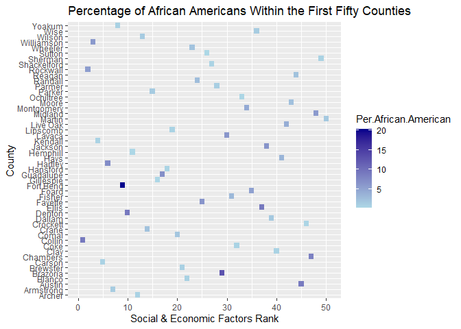<!-- -->

``` r
#####
#Second set of counties
Joined_stats$`Social & Economic Factors Rank`<-
as.numeric(as.character(Joined_stats$`Social & Economic Factors Rank`))
#had to define rank as numeric or else arrange function could not be performed
AARace2<- Joined_stats %>%
select(`Social & Economic Factors Rank`, County, `Per.African.American`, Population)%>%
#Selects necessary variables
filter(!is.na(`Social & Economic Factors Rank`))%>%
#filters NA from social economic factors rank
filter(`Social & Economic Factors Rank` >50 & `Social & Economic Factors Rank` <101)
#filters the first 50 counties with the highest social economic ranking
ggplot(AARace2, aes(`Social & Economic Factors Rank`, County, fill=`Per.African.American`)) +
geom_tile() +
ggtitle("Percentage of African Americans population in the Second Fifty Counties")+
scale_fill_gradient(low = "springgreen", high = "springgreen4")
```

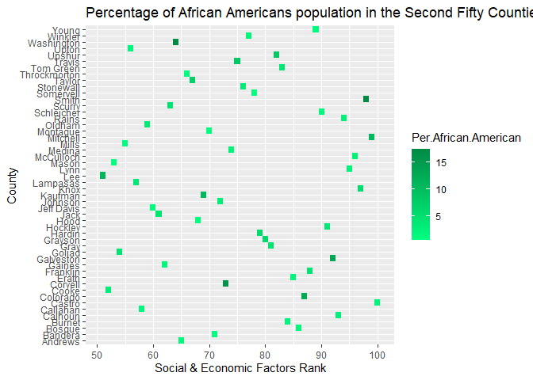<!-- -->

``` r
#####
#Third set of counties
Joined_stats$`Social & Economic Factors Rank`<-
as.numeric(as.character(Joined_stats$`Social & Economic Factors Rank`))
#had to define rank as numeric or else arrange function could not be performed
AARace3<- Joined_stats %>%
select(`Social & Economic Factors Rank`, County, `Per.African.American`, Population)%>%
#Selects necessary variables
filter(!is.na(`Social & Economic Factors Rank`))%>%
#filters NA from social economic factors rank
filter(`Social & Economic Factors Rank` >100 & `Social & Economic Factors Rank` <151)
#filters the first 50 counties with the highest social economic ranking
ggplot(AARace3, aes(`Social & Economic Factors Rank`, County, fill=`Per.African.American`)) +
geom_tile()+
ggtitle("Percentage of African Americans population in the Third Fifty Counties")+
scale_fill_gradient(low = "coral1", high = "coral4")
```

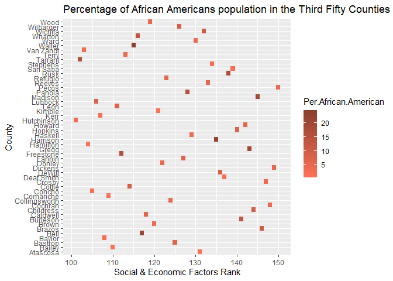<!-- -->

``` r
#####
#fourth set of counties
Joined_stats$`Social & Economic Factors Rank`<-
as.numeric(as.character(Joined_stats$`Social & Economic Factors Rank`))
#had to define rank as numeric or else arrange function could not be performed
AARace4<- Joined_stats %>%
select(`Social & Economic Factors Rank`, County, `Per.African.American`, Population)%>%
#Selects necessary variables
filter(!is.na(`Social & Economic Factors Rank`))%>%
#filters NA from social economic factors rank
filter(`Social & Economic Factors Rank` >150 & `Social & Economic Factors Rank` <201)
#filters the first 50 counties with the highest social economic ranking
ggplot(AARace4, aes(`Social & Economic Factors Rank`, County, fill=`Per.African.American`)) +
geom_tile()+
ggtitle("Percentage of African Americans population in the Fourth Fifty Counties")+
scale_fill_gradient(low = "chocolate", high = "chocolate4")
```

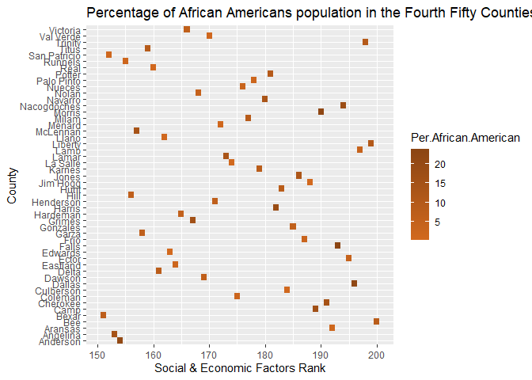<!-- -->

``` r
#fifth set of counties
Joined_stats$`Social & Economic Factors Rank`<-
as.numeric(as.character(Joined_stats$`Social & Economic Factors Rank`))
#had to define rank as numeric or else arrange function could not be performed
AARace5<- Joined_stats %>%
select(`Social & Economic Factors Rank`, County, `Per.African.American`, Population)%>%
#Selects necessary variables
filter(!is.na(`Social & Economic Factors Rank`))%>%
#filters NA from social economic factors rank
filter(`Social & Economic Factors Rank` >200 & `Social & Economic Factors Rank` <242)
#filters the first 50 counties with the highest social economic ranking
ggplot(AARace5, aes(`Social & Economic Factors Rank`, County, fill=`Per.African.American`)) +
geom_tile()+
ggtitle("Percentage of African Americans population in the Fifth Fifty Counties")+
scale_fill_gradient(low = "gold", high = "gold4")
```

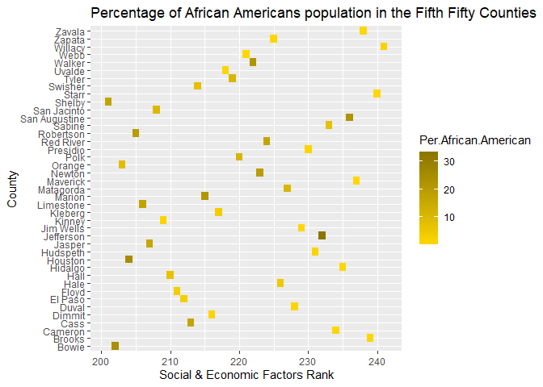<!-- -->

``` r
Joined_stats$`Social & Economic Factors Rank`<-
as.numeric(as.character(Joined_stats$`Social & Economic Factors Rank`))
#had to define rank as numeric or else arrange function could not be performed
WRace<- Joined_stats %>%
select(`Social & Economic Factors Rank`, County, `Per.NonHispanic.White`, Population)%>%
#Selects necessary variables
filter(!is.na(`Social & Economic Factors Rank`))%>%
#filters NA from social economic factors rank
filter(`Social & Economic Factors Rank` < 51)
#filters the first 50 counties with the highest social economic ranking
ggplot(WRace, aes(`Social & Economic Factors Rank`, County, fill=`Per.NonHispanic.White`)) +
geom_tile()+
ggtitle("Percentage of White Non-hispanic population in the First Fifty Counties")+
scale_fill_gradient(low = "lightblue", high = "darkblue")
```

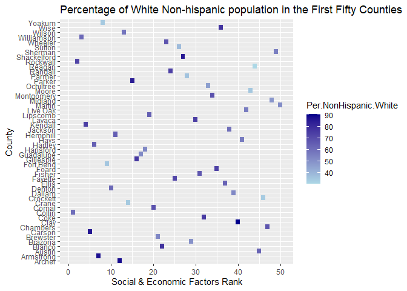<!-- -->

``` r
#####
#Second set of counties
Joined_stats$`Social & Economic Factors Rank`<-
as.numeric(as.character(Joined_stats$`Social & Economic Factors Rank`))
#had to define rank as numeric or else arrange function could not be performed
WRace2<- Joined_stats %>%
select(`Social & Economic Factors Rank`, County, `Per.NonHispanic.White`, Population)%>%
#Selects necessary variables
filter(!is.na(`Social & Economic Factors Rank`))%>%
#filters NA from social economic factors rank
filter(`Social & Economic Factors Rank` >50 & `Social & Economic Factors Rank` <101)
#filters the first 50 counties with the highest social economic ranking
ggplot(WRace2, aes(`Social & Economic Factors Rank`, County, fill=`Per.NonHispanic.White`)) +
geom_tile()+
ggtitle("Percentage of White Non-hispanic population in the Second Fifty Counties")+
scale_fill_gradient(low = "springgreen", high = "springgreen4")
```

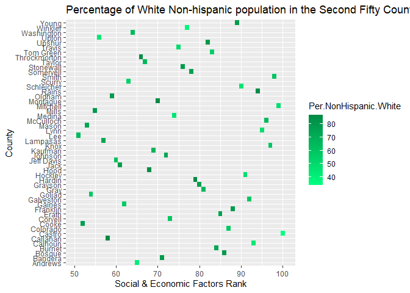<!-- -->

``` r
#####
#Third set of counties
Joined_stats$`Social & Economic Factors Rank`<-
as.numeric(as.character(Joined_stats$`Social & Economic Factors Rank`))
#had to define rank as numeric or else arrange function could not be performed
WRace3<- Joined_stats %>%
select(`Social & Economic Factors Rank`, County, `Per.NonHispanic.White`, Population)%>%
#Selects necessary variables
filter(!is.na(`Social & Economic Factors Rank`))%>%
#filters NA from social economic factors rank
filter(`Social & Economic Factors Rank` >100 & `Social & Economic Factors Rank` <151)
#filters the first 50 counties with the highest social economic ranking
ggplot(WRace3, aes(`Social & Economic Factors Rank`, County, fill=`Per.NonHispanic.White`)) +
geom_tile()+
ggtitle("Percentage of White Non-hispanic population in the Third Fifty Counties")+
scale_fill_gradient(low = "coral1", high = "coral4")
```

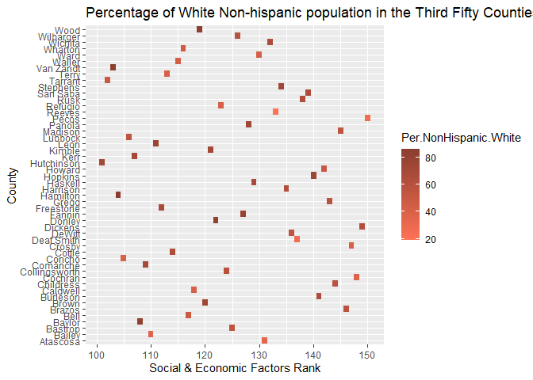<!-- -->

``` r
#####
#fourth set of counties
Joined_stats$`Social & Economic Factors Rank`<-
as.numeric(as.character(Joined_stats$`Social & Economic Factors Rank`))
#had to define rank as numeric or else arrange function could not be performed
WRace4<- Joined_stats %>%
select(`Social & Economic Factors Rank`, County, `Per.NonHispanic.White`, Population)%>%
#Selects necessary variables
filter(!is.na(`Social & Economic Factors Rank`))%>%
#filters NA from social economic factors rank
filter(`Social & Economic Factors Rank` >150 & `Social & Economic Factors Rank` <201)
#filters the first 50 counties with the highest social economic ranking
ggplot(WRace4, aes(`Social & Economic Factors Rank`, County, fill=`Per.NonHispanic.White`)) +
geom_tile()+
ggtitle("Percentage of White Non-hispanic population in the Fourth Fifty Counties")+
scale_fill_gradient(low = "chocolate", high = "chocolate4")
```

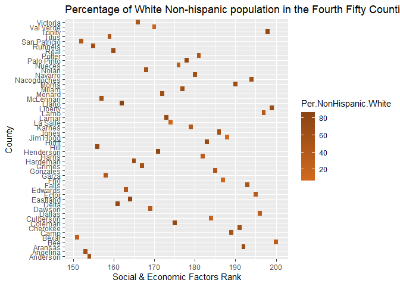<!-- -->

``` r
#fifth set of counties
Joined_stats$`Social & Economic Factors Rank`<-
as.numeric(as.character(Joined_stats$`Social & Economic Factors Rank`))
#had to define rank as numeric or else arrange function could not be performed
WRace5<- Joined_stats %>%
select(`Social & Economic Factors Rank`, County, `Per.NonHispanic.White`, Population)%>%
#Selects necessary variables
filter(!is.na(`Social & Economic Factors Rank`))%>%
#filters NA from social economic factors rank
filter(`Social & Economic Factors Rank` >200 & `Social & Economic Factors Rank` <242)
#filters the first 50 counties with the highest social economic ranking
ggplot(WRace5, aes(`Social & Economic Factors Rank`, County, fill=`Per.NonHispanic.White`)) +
geom_tile()+
ggtitle("Percentage of White Non-hispanic population in the Fifth Fifty Counties")+
scale_fill_gradient(low = "gold", high = "gold4")
```

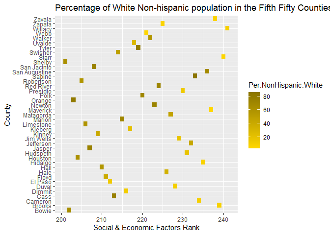<!-- --> I selected
Social & Economic Factors Rank, County, Population,
Per.African.Americans, and Per. NonHispanic White to find whether or not
there resided a majority of whites in higher ranked social economic
counties. Thirteen cases were dropped due to counties not having a
social economic factors rank. It was discovered that as the county
ranking for social and economics lowered there was a slight increase in
percentages of African Americans residing within counties. Whereas for
White non-hispanics the percentages became less varied among the lower
100.

\#\#Part 3: More Visualizations, this time with a scatterplot

``` r
SocEcoRank_Income<- Joined_stats %>%
select(`Social & Economic Factors Rank`, County, `Household.Income`)%>%
#Selects necessary variables
filter(!is.na(`Social & Economic Factors Rank`))
#filters NA from social economic factors rank
#filters the first 50 counties with the highest social economic ranking
ggplot(SocEcoRank_Income, aes(`Social & Economic Factors Rank`,`Household.Income`)) +
geom_point(color='red')+
ggtitle("Income based on county")+
geom_smooth(method=lm, se=FALSE, color = "darkgreen")
```

    ## `geom_smooth()` using formula 'y ~ x'

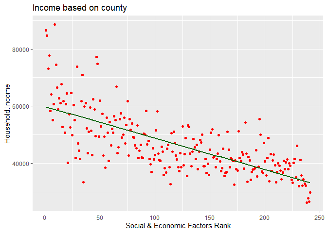<!-- -->

\#\#\#Part 4: Summary Statistics for the total population

``` r
#Min, max, mean, sd of the total population from each counties population
min(Joined_stats$Population)
```

    ## [1] 86

``` r
median(Joined_stats$Population)
```

    ## [1] 18440.5

``` r
max(Joined_stats$Population)
```

    ## [1] 4441370

``` r
mean(Joined_stats$Population)
```

    ## [1] 106129.8

``` r
sd(Joined_stats$Population)
```

    ## [1] 382320.6

The results are as shown above for min, median, max, mean, sd,
respectively for the total population. This was calculated to find the
min, median, max, mean, and sd for the total population of all the
counties.

\#\#Part 4: Summary Statistics for the African American population

``` r
#Min, max, mean, sd of the total population from each counties Percent of African American.
min(Joined_stats$`Per.African.American`)
```

    ## [1] 0

``` r
median(Joined_stats$`Per.African.American`)
```

    ## [1] 3.853597

``` r
max(Joined_stats$`Per.African.American`)
```

    ## [1] 33.42795

``` r
mean(Joined_stats$`Per.African.American`)
```

    ## [1] 6.275175

``` r
sd(Joined_stats$`Per.African.American`)
```

    ## [1] 6.486505

``` r
mean(Joined_stats$`Per.NonHispanic.White`)
```

    ## [1] 57.10775

``` r
sd(Joined_stats$`Per.NonHispanic.White`)
```

    ## [1] 20.77775

The results are as shown above for min, median, max, mean, sd,
respectively for the Non-Hispanic White American population. This was
calculated to find the min, median, max, mean, and sd for the
Non-Hispanic White American population of all the counties.
