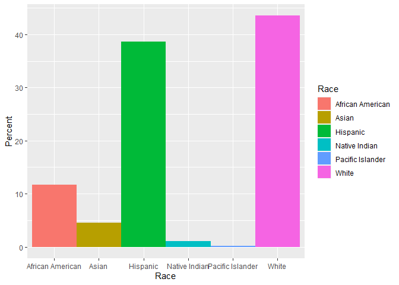
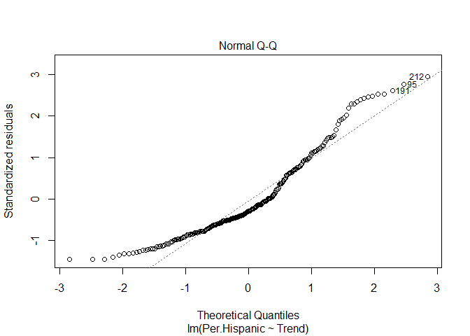

Trends Amoung Different Races Across Texas Counties
================
Project 2

### Adam Shaheen

This project involves the death rates of each county in Texas. I wanted
to find whether or not any correlations could be found between
socioeconomic status, population of different races, and falling,
rising, or stable death rates. Furthermore, the Ranking data set is a
ranking based on each counties total number of death rates. While the
County health ranking includes variables such as the population divided
up into different ethnicities, healthcare costs, and household income.
Both these datasets were derived from The County Health Rankings &
Roadmaps website, 2016 spreadsheets. I expect to find races with a low
household income to have high death rates due to their economic status
and typically low rankings across the boards. I also expect, due to the
deep systemic racism within our country, that nearly any race that does
not associate with being white will reside within these low ranking
counties.

##### Part 1: Creating Dataset plus formating

``` r
library(tidyverse)

library(dplyr)

library(readxl)

library(ggplot2)

Ranking <- read_excel("death rate per county.xlsx")

Ranking$Tot.Deaths[is.na(Ranking$Tot.Deaths)] <- 0

Ranking <- na.omit(Ranking)

County_Health_Rankings <- read_excel("2016 County Health.xlsx")

County_Health_Rankings[is.na(County_Health_Rankings)] <- 0

#the few lines above read excel files within the same work directory 
#and replaced missing values with 0
Joined_stats <- Ranking %>%
  
left_join(County_Health_Rankings, by="County") %>%
  mutate(Per.male=(100-Per.Female)) %>%
  mutate(AADeath = Tot.Deaths * (Per.African.American/100))%>%
  mutate(ADeath = Tot.Deaths * (Per.Asian/100))%>%
  mutate(HDeath = Tot.Deaths * (Per.Hispanic/100))%>%
  mutate(WDeath = Tot.Deaths * (Per.NonHispanic.White/100)) %>%
  filter(County !=  "Harris")%>%
  filter(County !=  "Dallas")%>%
  filter(County !=  "Tarrant")
#above is the creation of a unification of the newly defined data frames by county. I choose
#the left join because I wanted to add additional data to the rankings dataset
#new columns created to find exact percentages of male populations, deathrates of different races per county

head(Joined_stats)
```

    ## # A tibble: 6 x 27
    ##   County Tot.Deaths Trend Child.Deaths Infant.Deaths Drug.Overdose.D~
    ##   <chr>       <dbl> <chr>        <dbl>         <dbl>            <dbl>
    ## 1 Ander~       1048 risi~           29            25               19
    ## 2 Andre~        180 fall~           10             0                0
    ## 3 Angel~       1213 stab~           43            44               21
    ## 4 Arans~        497 stab~           14             0               12
    ## 5 Archer        109 stab~            0             0                0
    ## 6 Atasc~        613 fall~           24            22                0
    ## # ... with 21 more variables: Motor.Vehicle.Deaths <dbl>,
    ## #   Household.Income <dbl>, Segregation.index.of.African.Americans <dbl>,
    ## #   `Segregation.Index.of.non-White.races` <dbl>, Population <dbl>,
    ## #   Per.over.18 <dbl>, Per.65.and.over <dbl>, Per.African.American <dbl>,
    ## #   `Per.American.Indian/Alaskan.Native` <dbl>, Per.Asian <dbl>,
    ## #   `Per.Native.Hawaiian/Other.Pacific.Islander` <dbl>, Per.Hispanic <dbl>,
    ## #   Per.NonHispanic.White <dbl>, Per.Female <dbl>, Per.Rural <dbl>, `Social &
    ## #   Economic Factors Rank` <dbl>, Per.male <dbl>, AADeath <dbl>, ADeath <dbl>,
    ## #   HDeath <dbl>, WDeath <dbl>

The datasets were documented as excel spreadsheets and the common
variable were counties in Texas. With the two new spread sheets I
imported them as seen through lines 35 & 42 declaring two new data
frames, Ranking and County Health Rankings. In order to combine these
two data frames I preformed a left join by county and created a new data
frame of their unification, Joined stats. I choose the left join due to
its ability to add additional data to the newly defined dataframe,
Joined stats. The data outputted is the first six rows of the three data
frames seen in order from when they were declared aswell as the number
of columns and rows for each. My job was made easier since I did not
need to tidy the data, all variables had columns, all rows had
observations, and each value had its own observation. Addition of
mutated rows was to determine the actual number, based on total deaths
within each county, of dead by which race they identified as.

##### Part 2.1 EDA and MANOVA Testing

``` r
All_Texas <- read_excel("All Of Texas.xlsx")

ggplot(All_Texas, aes(x=Race, y=Percent, fill = Race)) + 
  geom_bar(stat="identity", width = 1)#shows the percent of different races in Texas
```



``` r
Joined_manova <- manova(cbind(Per.NonHispanic.White,Per.Hispanic) ~ Trend, data = Joined_stats)

summary(Joined_manova)
```

    ##            Df   Pillai approx F num Df den Df Pr(>F)  
    ## Trend       2 0.053929   3.0899      4    446 0.0158 *
    ## Residuals 223                                         
    ## ---
    ## Signif. codes:  0 '***' 0.001 '**' 0.01 '*' 0.05 '.' 0.1 ' ' 1

``` r
Joined_manova2 <- manova(cbind(Per.Asian,Per.NonHispanic.White) ~ Trend, data = Joined_stats)

summary(Joined_manova2)
```

    ##            Df   Pillai approx F num Df den Df Pr(>F)
    ## Trend       2 0.020567   1.1585      4    446 0.3285
    ## Residuals 223

``` r
Joined_manova3 <- manova(cbind(Per.NonHispanic.White,Per.African.American) ~ Trend, data = Joined_stats)

summary(Joined_manova3)
```

    ##            Df   Pillai approx F num Df den Df   Pr(>F)   
    ## Trend       2 0.061179   3.5184      4    446 0.007665 **
    ## Residuals 223                                            
    ## ---
    ## Signif. codes:  0 '***' 0.001 '**' 0.01 '*' 0.05 '.' 0.1 ' ' 1

``` r
# OUtput of MANOVA
```

My findings included significant differences in trends, whether a
population’s death rate rose, fell or was the same, between percentages
of nonhispanic white and Hispanic communities, and nonhispanic white and
African American communities. However there was no significant
differences in trends between Asian and nonhispanic white communities.
Each of these findings were determined through the p-value.

##### Part 2.2 ANOVA’s and Post-Hoc Tests

``` r
#AOVA TEST

summary(aov(Per.NonHispanic.White ~ Trend, data = Joined_stats))
```

    ##              Df Sum Sq Mean Sq F value Pr(>F)
    ## Trend         2   1561   780.5   1.863  0.158
    ## Residuals   223  93425   418.9

``` r
summary(aov(Per.Hispanic ~ Trend, data = Joined_stats))
```

    ##              Df Sum Sq Mean Sq F value Pr(>F)  
    ## Trend         2   3604    1802   3.506 0.0317 *
    ## Residuals   223 114622     514                 
    ## ---
    ## Signif. codes:  0 '***' 0.001 '**' 0.01 '*' 0.05 '.' 0.1 ' ' 1

``` r
summary(aov(Per.Asian ~ Trend , data = Joined_stats))
```

    ##              Df Sum Sq Mean Sq F value Pr(>F)
    ## Trend         2    1.9   0.941   0.271  0.763
    ## Residuals   223  774.5   3.473

``` r
summary(aov(Per.African.American ~ Trend , data = Joined_stats))
```

    ##              Df Sum Sq Mean Sq F value  Pr(>F)   
    ## Trend         2    478  239.12   5.839 0.00338 **
    ## Residuals   223   9133   40.95                   
    ## ---
    ## Signif. codes:  0 '***' 0.001 '**' 0.01 '*' 0.05 '.' 0.1 ' ' 1

``` r
#Post-Hoc test

pairwise.t.test(Joined_stats$Per.Hispanic, Joined_stats$Trend, p.adj = "none")
```

    ## 
    ##  Pairwise comparisons using t tests with pooled SD 
    ## 
    ## data:  Joined_stats$Per.Hispanic and Joined_stats$Trend 
    ## 
    ##        falling rising
    ## rising 0.31    -     
    ## stable 0.01    0.75  
    ## 
    ## P value adjustment method: none

``` r
pairwise.t.test(Joined_stats$Per.African.American, Joined_stats$Trend, p.adj = "none")
```

    ## 
    ##  Pairwise comparisons using t tests with pooled SD 
    ## 
    ## data:  Joined_stats$Per.African.American and Joined_stats$Trend 
    ## 
    ##        falling rising
    ## rising 0.7560  -     
    ## stable 0.0011  0.2257
    ## 
    ## P value adjustment method: none

While conducting the ANOVA tests I concluded that there were significant
results when testing the percentages of African American and Hispanic
populations within counties and their corresponding trend. Asian and
White populations did not have significant results when compared to
their Trends. Within the post-hoc tests for the Hispanic and African
American percentages the paired up trends, falling and rising, rising
and stable, have similar means, but, the falling and stable pair had
significant differences in their means.

##### Part 3 Linear Regression & Logistic Regression

``` r
ggplot(Joined_stats, aes(x = Per.African.American, y =AADeath, color = Trend)) +
  geom_point() +
  geom_smooth(method = lm, se = FALSE, fullrange=TRUE)
```


``` r
ggplot(Joined_stats, aes(x = Per.Asian, y =ADeath, color = Trend)) +
  geom_point() +
  geom_smooth(method = lm, se = FALSE, fullrange=TRUE)
```


``` r
ggplot(Joined_stats, aes(x = Per.Hispanic, y =HDeath, color = Trend)) +
  geom_point() +
  geom_smooth(method = lm, se = FALSE, fullrange=TRUE)
```


``` r
fit <- lm(Per.NonHispanic.White ~ Trend, Joined_stats)

summary(fit)
```

    ## 
    ## Call:
    ## lm(formula = Per.NonHispanic.White ~ Trend, data = Joined_stats)
    ## 
    ## Residuals:
    ##     Min      1Q  Median      3Q     Max 
    ## -56.299 -12.787   3.361  15.865  35.799 
    ## 
    ## Coefficients:
    ##             Estimate Std. Error t value Pr(>|t|)    
    ## (Intercept)   60.018      2.233  26.874   <2e-16 ***
    ## Trendrising  -11.549     10.475  -1.103    0.271    
    ## Trendstable   -4.949      2.833  -1.747    0.082 .  
    ## ---
    ## Signif. codes:  0 '***' 0.001 '**' 0.01 '*' 0.05 '.' 0.1 ' ' 1
    ## 
    ## Residual standard error: 20.47 on 223 degrees of freedom
    ## Multiple R-squared:  0.01643,    Adjusted R-squared:  0.007612 
    ## F-statistic: 1.863 on 2 and 223 DF,  p-value: 0.1576

``` r
plot(fit, which = 1)
```


``` r
plot(fit, which = 2)
```


``` r
# Robust Standard Errors for fit 1


fit2 <- lm(Per.African.American ~ Trend, Joined_stats)

summary(fit2)
```

    ## 
    ## Call:
    ## lm(formula = Per.African.American ~ Trend, data = Joined_stats)
    ## 
    ## Residuals:
    ##    Min     1Q Median     3Q    Max 
    ## -8.020 -4.589 -1.835  2.619 25.113 
    ## 
    ## Coefficients:
    ##             Estimate Std. Error t value Pr(>|t|)    
    ## (Intercept)   8.3151     0.6982  11.909  < 2e-16 ***
    ## Trendrising   1.0187     3.2751   0.311  0.75605    
    ## Trendstable  -2.9246     0.8856  -3.302  0.00112 ** 
    ## ---
    ## Signif. codes:  0 '***' 0.001 '**' 0.01 '*' 0.05 '.' 0.1 ' ' 1
    ## 
    ## Residual standard error: 6.4 on 223 degrees of freedom
    ## Multiple R-squared:  0.04976,    Adjusted R-squared:  0.04124 
    ## F-statistic: 5.839 on 2 and 223 DF,  p-value: 0.003376

``` r
plot(fit2, which = 1)
```


``` r
plot(fit2, which = 2)
```


``` r
# Robust Standard Errors for fit 2


fit3 <- lm(Per.Hispanic ~ Trend, Joined_stats)

summary(fit3)
```

    ## 
    ## Call:
    ## lm(formula = Per.Hispanic ~ Trend, data = Joined_stats)
    ## 
    ## Residuals:
    ##     Min      1Q  Median      3Q     Max 
    ## -32.886 -16.763  -6.585  14.486  66.398 
    ## 
    ## Coefficients:
    ##             Estimate Std. Error t value Pr(>|t|)    
    ## (Intercept)   28.852      2.474  11.664   <2e-16 ***
    ## Trendrising   11.714     11.603   1.010   0.3138    
    ## Trendstable    8.104      3.137   2.583   0.0104 *  
    ## ---
    ## Signif. codes:  0 '***' 0.001 '**' 0.01 '*' 0.05 '.' 0.1 ' ' 1
    ## 
    ## Residual standard error: 22.67 on 223 degrees of freedom
    ## Multiple R-squared:  0.03049,    Adjusted R-squared:  0.02179 
    ## F-statistic: 3.506 on 2 and 223 DF,  p-value: 0.03168

``` r
plot(fit3, which = 1)
```


``` r
plot(fit3, which = 2)
```



``` r
# Robust Standard Errors for fit 3


fit4 <- lm(Per.Asian ~ Trend, Joined_stats)

summary(fit4)
```

    ## 
    ## Call:
    ## lm(formula = Per.Asian ~ Trend, data = Joined_stats)
    ## 
    ## Residuals:
    ##     Min      1Q  Median      3Q     Max 
    ## -1.0377 -0.6684 -0.4588 -0.1262 17.8684 
    ## 
    ## Coefficients:
    ##             Estimate Std. Error t value Pr(>|t|)    
    ## (Intercept)   1.2602     0.2033   6.198 2.74e-09 ***
    ## Trendrising  -0.5618     0.9537  -0.589    0.556    
    ## Trendstable  -0.1378     0.2579  -0.534    0.594    
    ## ---
    ## Signif. codes:  0 '***' 0.001 '**' 0.01 '*' 0.05 '.' 0.1 ' ' 1
    ## 
    ## Residual standard error: 1.864 on 223 degrees of freedom
    ## Multiple R-squared:  0.002424,   Adjusted R-squared:  -0.006523 
    ## F-statistic: 0.2709 on 2 and 223 DF,  p-value: 0.7629

``` r
plot(fit4, which = 1)
```


``` r
plot(fit4, which = 2)
```


``` r
# Robust Standard Errors for fit 4


predict(fit4, newdata = data.frame(Trend = c("stable","rising","falling")))
```

    ##         1         2         3 
    ## 1.1224250 0.6983924 1.2602003

``` r
#LOGISTIC REGRESSION

# Fit a new regression model

#fit <- glm(Trend1 ~ Per.Hispanic, data = Joined_stats, family = binomial(link="logit"))
#summary(fit)

# Interpret the coefficients by considering the odds (inverse of log(odds))
#exp(coef(fit))
```

These coefficients are derived from a prediction of the linear
regression for the Asian American population. Firstly, the 1.12
coefficient shows the predicted value of the mean Asian American
population with a stable death rate trend. The subsequent values, 0.69,
1.26, show the prediction value of a rising and falling death rate
trend, respectively.
